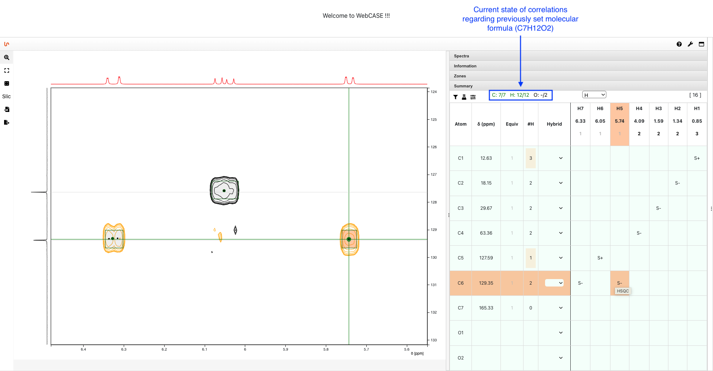

# Sherlock (Frontend)

Frontend service for [Sherlock](https://github.com/michaelwenk/sherlock).

## Main Components

### NMRium

[NMRium](https://github.com/cheminfo/nmrium) is used as component for the (pre-)processing and visualization of 1D/2D NMR data.

In addition to that, it contains a summary panel consisting of a correlation table and certain parameters to set, i.e. a molecular formula:

    

This information is then used in dereplication or elucidation process in Sherlock.

### Sherlock

[Sherlock](https://github.com/michaelwenk/sherlock) aims to support the dereplication or elucidation of (un)known natural products.

For both procedures it is allowed to set parameters beforehand.
Here is an example for elucidation parameter settings:

    

After running the dereplication or elucidation, a list of ranked structure proposals appears. The result can be downloaded as SDF as well.

    

## Usage

### Docker and Application Start/Stop

This project uses [Docker](https://www.docker.com). Make sure that docker is installed.

#### Use pre-built Container Image

Use this command to download the pre-built image from Docker Hub:

    docker pull michaelwenk/sherlock-frontend

#### Build of Container Image

If you want to build the container image by yourself, you need to first clone this repository and change the directory:

    git clone https://github.com/michaelwenk/sherlock-frontend.git
    cd sherlock-frontend

Then build the container image using following command:

    docker build -t michaelwenk/sherlock-frontend .

#### Start

To start this service (in detached mode) use:

    docker run -d -p 3001:5000 --name sherlock-frontend michaelwenk/sherlock-frontend

As configured above, the backend service does allow requests from port 3001 only.

The web service is now accessible via:

    http://localhost:3001/

#### Stop

To stop this application use

    docker stop sherlock-frontend
