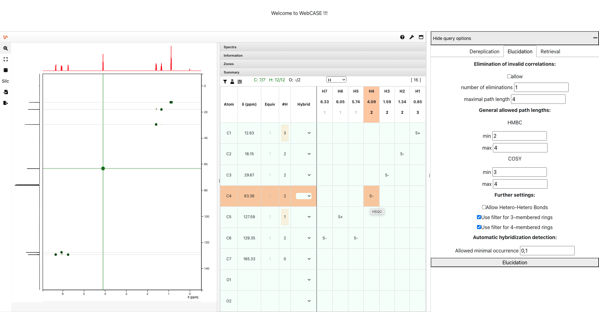
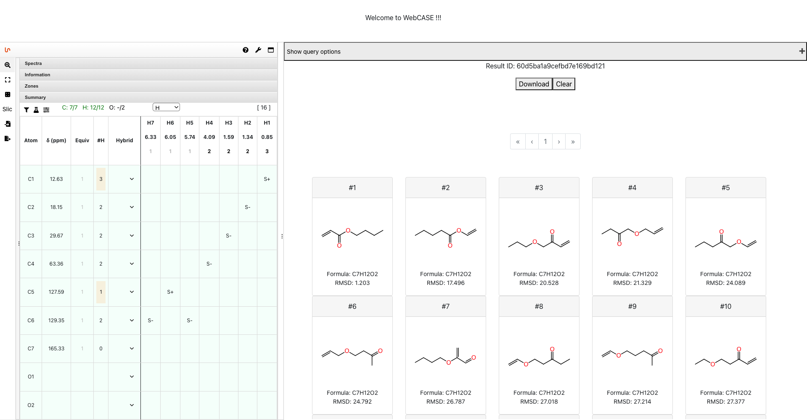

# WebCASE (Frontend)

Frontend service for [WebCASE](https://github.com/michaelwenk/webcase).

## Main Features
### NMRium
[NMRium](https://github.com/cheminfo/nmrium) is used as component for the (pre-)processing and visualization of 1D/2D NMR data.

In addition to that, it contains a summary panel consisting of a correlation table and certain parameters to set, i.e. a molecular formula: 

This information is then used in dereplication or elucidation process in WebCASE.

### WebCASE
[WebCASE](https://github.com/michaelwenk/webcase) aims to support the dereplication or elucidation of (un)known natural products.

For both procedures it is allowed to set parameters for optimizations. 

Example for elucidation parameter settings:

After executing the dereplication or elucidation, a list of ranked structure proposals is shown. Which can also be downloaded as SDF.

## Usage
### Docker and Application Start/Stop

This project uses [Docker](https://www.docker.com). Make sure that docker is installed.

#### Use pre-built Container Image

Use this command to download the pre-built image from Docker Hub:

    docker pull michaelwenk/webcase-frontend

#### Build of Container Image

If you want to build the container image by yourself, you need to first clone this repository and change the directory:

    git clone https://github.com/michaelwenk/webcase-frontend.git
    cd webcase-frontend

Then build the container image using following command:

    docker build -t webcase-frontend .

#### Start

To start this service (in detached mode) use:

    docker run -d -p 3001:3000 --name webcase-frontend michaelwenk/webcase-frontend

As configured above, the backend service does allow requests from port 3001 only.

The web service is now accessible via:

    http://localhost:3001/

#### Stop

To stop this application use

    docker stop webcase-frontend
