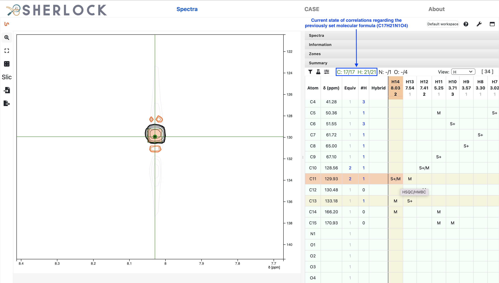
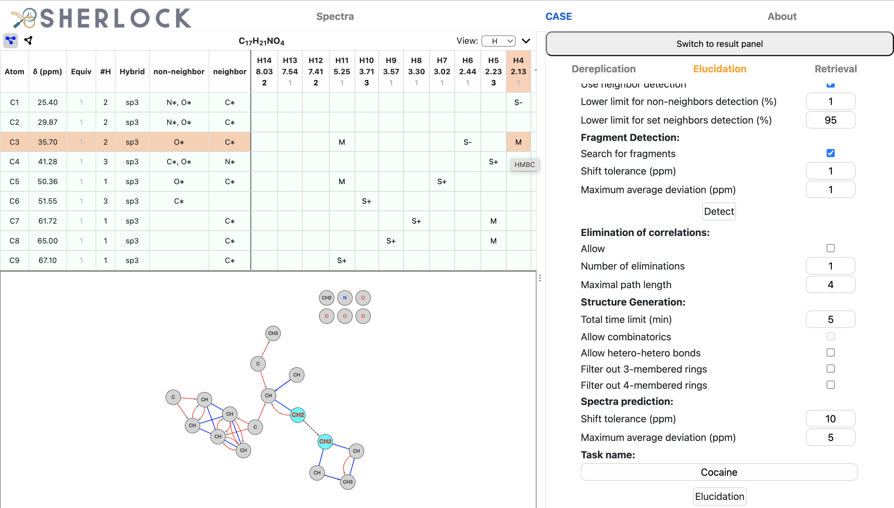
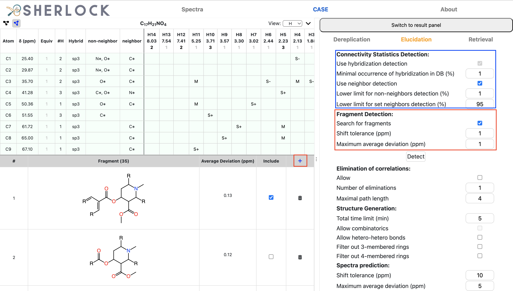
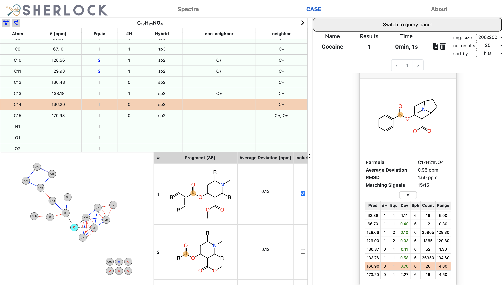
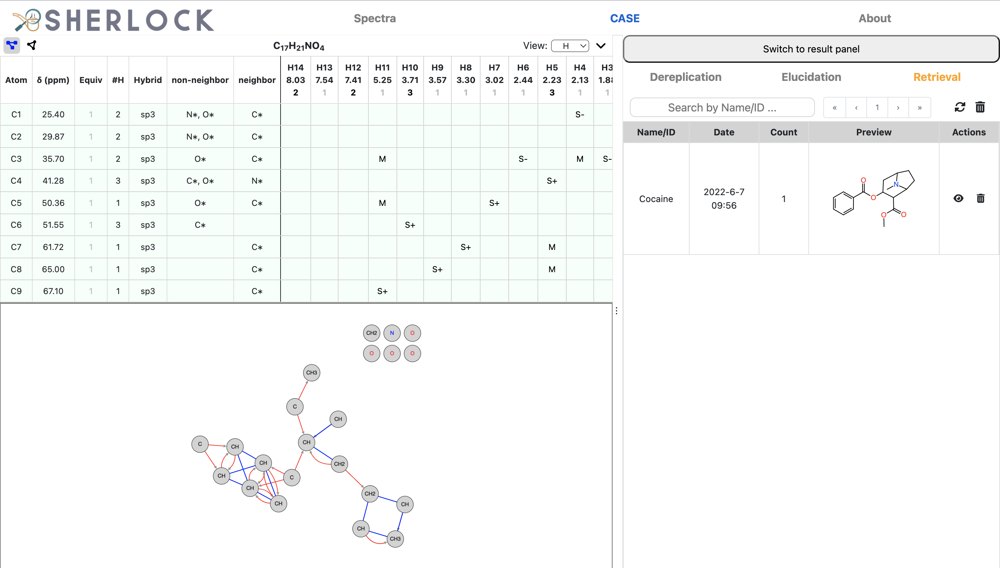

# Sherlock (Frontend)

Frontend service for [Sherlock](https://github.com/michaelwenk/sherlock).

## Main Components

### NMRium

[NMRium](https://github.com/cheminfo/nmrium) is used as component for the (pre-)processing and visualization of 1D/2D NMR data.

In addition to that, it contains a summary panel consisting of a correlation table and certain parameters to set, i.e. a molecular formula:

    

This information is then used in dereplication or elucidation process in Sherlock.

### Sherlock

[Sherlock](https://github.com/michaelwenk/sherlock) aims to support the dereplication or elucidation of (un)known natural products.

For both procedures it is allowed to set parameters beforehand.
Here is an example for elucidation parameter settings:

    

A molecular connectivity diagram can be enabled to have an overview of the correlations (first button in upper left button list).

Next to the detection of structural constrains (hybridizations, set/forbidden neighbors) for carbons by statistics (blue frame), Sherlock provides also the search for fragments (red frames) where both can be used during the structure generation process. The user can decide wether a substructure should be included or not.
Custom fragments can be imported (MOL file format) or drawn/edited in a structural editor view when clicking on the blue "+" button in fragment table header.

    

When the dereplication or elucidation process has finished, a list of ranked structure proposals appears. Some meta information is provided, including an expandable table which holds the signal-atom assignment of the result and the matching signal-signal pairs to the query spectrum.
The result can be downloaded as SDF.

    

The result is stored automatically by Sherlock to offer the retrieval of previously run elucidation tasks at any time.

    

## Usage

### Docker and Application Start/Stop

This project uses [Docker](https://www.docker.com). Make sure that docker is installed.

#### Use pre-built Container Image

Use this command to download the pre-built image from Docker Hub:

    docker pull michaelwenk/sherlock-frontend

#### Start

To start this service (in detached mode) use:

    docker run -d -p 3001:5000 --name sherlock-frontend michaelwenk/sherlock-frontend

As configured above, the backend service does allow requests from port 3001 only.

The web service is now accessible via:

    http://localhost:3001/

#### Stop

To stop this application use

    docker stop sherlock-frontend

#### Build of Container Image

If you want to build the container image by yourself, you need to first clone this repository and change the directory:

    git clone https://github.com/michaelwenk/sherlock-frontend.git
    cd sherlock-frontend

Then build the container image using following command:

    docker build -t michaelwenk/sherlock-frontend .
